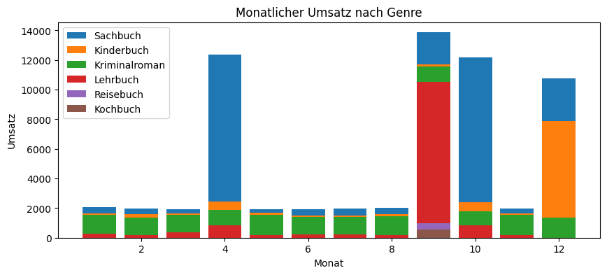

# Data Science Hausarbeit

_INF21D - Grundlagen Data Science WS 23/24 - Gruppe 9_  
_Philipp Eichwald, Joshua Luipold, Luis Neumeier_

## 1. In welchem Bezirk befindet sich die Buchhandlung?
Unter der Annahme, dass die meisten Kunden in der Nähe der Buchhandlung wohnen, können wir durch die Analyse der Kundenadressen den Bezirk der Buchhandlung herausfinden.

ANTWORT: Die Analyse liegt nahe, dass die **Buchhandlung in Bezirk 4** liegt, da dies in über 63% der Transaktionen der Wohnort der Kunden ist. 

## 2. In welchem Bezirk wohnt die Mehrzahl der Studenten?
Dazu betrachten wir nur die Kunden, die als Beruf "Student" angegeben haben und sortieren sie nach Wohnort.

ANTWORT: Die Analyse zeigt, dass über **88% der Studenten im Bezirk 6** wohnt.

## 3. Welche Fakultät befindet sich in der Außenstelle der Universität in deinem Viertel?
Dazu können wir die gekauften Bücher der Studenten analysieren.

ANTWORT: Da die Titel der gekauften Bücher überwiegend das Thema Recht aufgreifen, liegt es nahe dass die **Fakultät für Rechtswissenschaft** nahe der Buchhandlung liegt.

## 4. Clustere die verkauften Bücher für die Analyse sinnvoll in Genres
Dazu können wir die Buchtitel analysieren und die Bücher in Genres clustern. Für das Clustering wurde GPT4 verwendet.

## Aufgabe 5: Clustere die Berufe sinnvoll in Berufsgruppen
Hierzu werden die vorverarbeiteten Daten in drei Kategorien unterteilt: Kind, Angestellt, Arbeitslos, Rentner

## Aufgabe 6: Erstelle Kundenprofile
Welche sind die drei wichtigsten Kundenprofile für den 
Bücherabsatz in deinem Ladengeschäft? Charakterisiere die Kundenprofile.

Dazu werden zunächst die Zusammenhänge von Berufsgruppen und Genre analysiert, bevor das Kauffverhalten (spontan vs. vorbestellt) nach Gruppen untersucht wird.

ANTWORT: Die Analyse lässt die Charakterisierung von drei Kundenprofilen zu.

### "Der Lehrling"
- Doktorant oder Student
- Kauft hauptsächlich Sachbücher
- Kauft hauptsächlich spontan

### "Der Fürsorgliche"
- Elternteil oder Großelternteil
- Kauft gerne Kinder- oder Lehrbücher
- Bestellt hauptsächlich vor

### "Der Gelangweilte"
- Rentner, Pensionär oder Arbeitslos
- Kauft gerne Kriminalromane, vereinzelt auch Kinderbücher
- Kauft hauptsächlich spontan

## Aufgabe 7: Erstelle eine Umsatzanalyse für 2023 auf Monatsbasis
Was sind die Schwerpunktmonate?

Dazu wird der Umsatz je Monat nach Genre und nach Berufsgruppe visualisiert.

ANTWORT: Die Visualisierungen zeigen, dass die Monate **April, September, Oktober und Dezember die umsatzstärksten sind**. Dabei werden im April und Oktober hauptsächlich Sachbücher von Studenten gekauft (Semesterstarts), während im September die Eltern Lehrbücher kaufen. Im Dezember werden vermehrt  Kinderbücher gekauft, vermutlich als Weihnachtsgeschenk.

## Aufgabe 8: Analysiere die Nichtschwerpunktmonate und die Schwerpunktmonate
Welche Kundenprofile kaufen wann was?

Da die Visualisierung einer dreidimensionalen Beziehung schwierig ist, wird jeweils die Relation zwischen zwei Dimensionen visualisiert.
- Wer kauft was? (Berufsgruppe zu Genre)
- Wer kauft wann? (Berufsgruppe zu Monat)
- Was wird wann gekauft? (Genre zu Monat)

## Aufgabe 9: Welche Bücher ins Schaufenster?
Wir nehmen an, dass das Ausstellen von Büchern mit dem maximalen Umsatz im jeweiligen Monat am sinnvollsten ist. Daher suchen wir für jeden Monat die umsatzstärksten Bücher und stellen diese aus.

ANTWORT: Die exakten Titel sind der Tabelle unten zu entnehmen. Auffällig ist hierbei wieder das **Angebot an Kinderbüchern im Dezember**, sowie der **Verkauf von Sachbüchern in den Monaten April und Oktober**.

## Aufgabe 10: Welche Bücher in die Ladenecke?
Da die Ecke klein ist und die Vorfinanzierung des Buchbestandes Geld kostet, sollten hier nur Bücher ausgestellt werden die auch tatsächlich gekauft werden.
Außerdem sollte sichergestellt werden, dass die Nachfrage immer ausreichend gedeckt ist, um keinen Umsatz entgehen zu lassen.

Die Antwort auf diese Aufgabe ist eng mit Aufgabe 09 verknüpft und kann auf die gleichen Informationen zurückgreifen. In die Ladenecke sollten aber nur Bücher, die sich garantiert verkaufen. Dafür kann ein dynamischer Schwellenwert eingeführt werden, der entweder eine minimale Anzahl an Verkäufen vorgibt (z.B. 50 Verkäufe pro Jahr) oder ein Perzentil der am besten verkauften Bücher wiederspiegelt (z.B. Top 5%).

ANTWORT: Je nach Festlegung des Schwellenwerts werden unterschiedlich viele Bücher ausgestellt. Bei Wahl der Top 5% sind es 9 Bücher, die alle Verkaufszahlen von über 50 Stück pro Jahr ausweisen. Diese sind in der Grafik oben abgebildet. Je nach Risikobereitschaft sollte die initiale Beschaffung sich an den Verkaufszahlen des letzten Jahres orientieren.